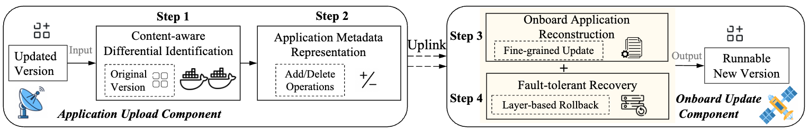

# SateLight: A Satellite Application Update Framework for Satellite Computing


 We release data and code used in this study to support reproducibility and future research.

## Evaluated Satellite Applications

 - The benchmark includes 10 representative satellite applications, labeled App1 to App10, located in the `SatelliteApplications/` directory.
 - For each application, we provide the original code along with three updated versions reflecting 10%, 20%, and 50% code modifications.
   
    | AppID | Satellite Applications        |
    | ----- | ----------------------------- |
    | App1  | Object Detection              |
    | App2  | Core Network                  |
    | App3  | Image Encoding                |
    | App4  | Client Cache                  |
    | App5  | Multi-Stage Image Compression |
    | App6  | Ship Detection                |
    | App7  | Tracking Algorithm            |
    | App8  | Data Compression              |
    | App9  | Attitude Determination        |
    | App10 | Change Detection and Encoding |

## Satellite Application Update Framework Code



 SateLight implements an application update framework for satellite-ground systems through two core components, located in the `SateLightCode/` directory.

 - The Application Upload Component, deployed on the ground, is responsible for performing content-aware differential analysis between the updated and original containerized application versions (Step 1). It identifies semantic changes and encodes them into an expressive metadata representation (Step 2). 
    - The main implementation is provided in the file `write_diff.py` and `myers.py`.
 - The Onboard Update Component, residing in the satellite system, receives the update payload and executes a fine-grained application reconstruction process to ensure update consistency and integrity (Step 3). In addition, it integrates a fault-tolerant recovery mechanism based on container image layering, enabling rapid rollback to a previous state in case of update failures (Step 4).
    - The main implementation is provided in the file `subsitute.py`.
- Other code
    - We provide scripts for generating application update variants across different programming languages. (`file_change_js.py`, `file_change_m.py`, `file_change.py`, `dir_change_js.py`, `dir_change_m.py`, and `dir_change.py`)
    - We provide a script to quantify the extent of code modifications between two versions of a satellite application. (`get_change_rate.py`)


## Real-world Satellite Deployment Code

- We provide the related code used to deploy a real-world satellite case, available in the `RealWorldDeployment/` directory.

## Usage

### Usage Structure for Required Files

```markdown
.
├── write_diff.py
├── diff_content/
├── myers.py
├── substitute.py
├── detection.py
├── workspace/
│   ├── diff_content/
│   └── tmp
│       ├── extract_dir/
│       ├── staged_diff_content/
│       │   └── diff_content/
│       └── staged_layer/
└── write_diff.py
```

A structure like the one above is required for correct execution of the scripts. This structure is encoded in the scripts. It is not strictly mandatory, but any changes must be reflected in the paths defined in the scripts.

### Running on Ground Station

On the ground, you need to run `write_diff.py` with one of three arguments: `layer`, `all`, or `inc`. The script generates the differential content to be uploaded to the satellite.

- `layer`: generate differences at the layer level
- `all`: generate differences at the file level
- `inc`: generate differences at the content level

Running the script will produce a `diff_content.tar.gz` file in the current directory. Paths in the script may need adjustment; these correspond to the first and second arguments of the `write_diff` function.

```bash
# Example usage
python write_diff.py layer
```

### Running on Satellite

On the satellite, you need to run `substitute.py` with two arguments: the update mode and the backup mode.

- **Update mode**: same as `write_diff.py` (`layer`, `all`, `inc`)
- **Backup mode**: `none`, `layer`, `file`, or `patch`, representing no backup, layer-level, file-level, or patch-level backup

Not all combinations are valid. Supported combinations are:

- `layer none`
- `all none`
- `inc none`
- `inc layer`
- `inc file`
- `inc patch`

For layer- or file-level updates, `none` means no backup. For content-level (`inc`) updates, you can choose a backup mode.

```bash
# Example usage
python substitute.py inc patch
```

### Failure Detection

To monitor container runtime status, use `detection.py`. This script detects error states. When a rollback is needed due to a failed image, it will invoke `substitute.py`. Make sure to correctly specify the script’s location and any required parameters.

```bash
# Example usage
python substitute.py inc patch
```